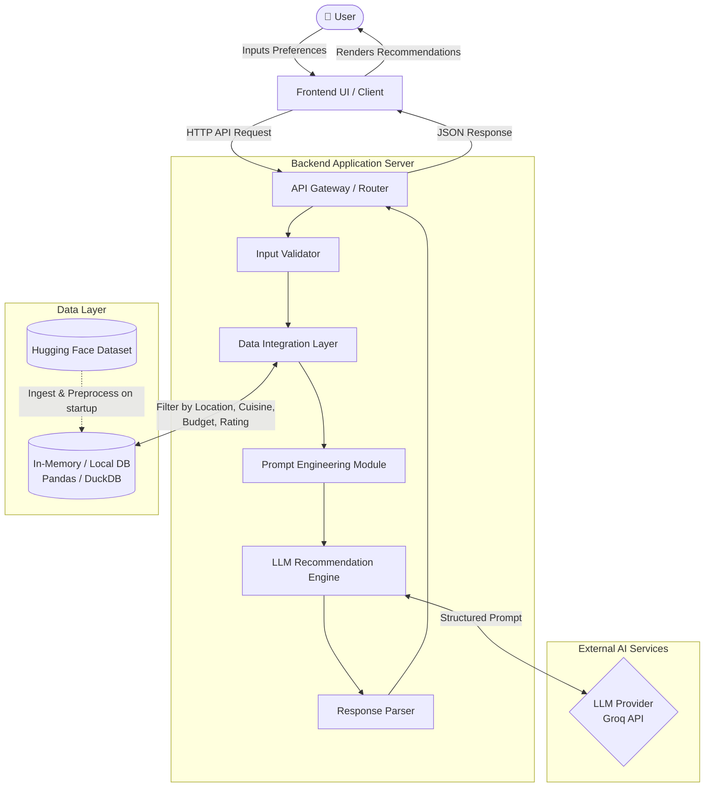

# System Architecture: AI-Powered Restaurant Recommendation System

This document outlines the detailed architecture for the Zomato-inspired recommendation system, as defined in `context.md`. The architecture integrates structured dataset querying with the reasoning capabilities of a Large Language Model (LLM).

---

## 1. High-Level Architecture Diagram

The system follows a 3-tier architecture (Client → Backend Server → Data/AI Layer), with specialized sub-components for dataset filtering and LLM prompt engineering.



---

## 2. Core Components

### 2.1 Frontend UI (Client)
- **Role**: Entry point for the user. Collects preferences and renders the final recommendations.
- **Key Responsibilities**:
  - Render interactive forms for **Location**, **Budget**, **Cuisine**, **Minimum Rating**, and **Additional Preferences**.
  - Make HTTP POST requests to the Backend API with the user's preference payload.
  - Display a structured list of recommended restaurants as cards, each containing:
    - Restaurant Name, Cuisine, Rating, Estimated Cost, and AI-generated Explanation.
- **Recommended Tech**: React / Next.js with Tailwind CSS or Vanilla CSS.

---

### 2.2 Backend Application Server
- **Role**: Central orchestrator that manages data flow between the client, the database, and the LLM.
- **Key Responsibilities**:
  - Expose a REST API endpoint (e.g., `POST /api/recommend`).
  - Validate and sanitize incoming user input.
  - Coordinate the Data Integration Layer and LLM Engine in sequence.
  - Handle errors gracefully and return descriptive error messages to the client.
- **Recommended Tech**: Python with **FastAPI** (supports async, auto-docs via Swagger).

---

### 2.3 Data Integration Layer
- **Role**: Manages the structured Zomato restaurant dataset.
- **Key Responsibilities**:
  - **Ingestion**: Load the [`ManikaSaini/zomato-restaurant-recommendation`](https://huggingface.co/datasets/ManikaSaini/zomato-restaurant-recommendation) dataset from Hugging Face at application startup.
  - **Preprocessing**:
    - Clean the data: handle `NaN` values, standardize text case.
    - Normalize budget/cost fields into discrete categories (low / medium / high).
    - Cache the cleaned dataset in memory for fast querying.
  - **Filtering**: Apply hard filters from user input:
    - `location == user_location`
    - `cuisine CONTAINS user_cuisine`
    - `rating >= user_min_rating`
    - `avg_cost_for_two` within the selected budget range
  - Returns the top-N matching records (e.g., 10–15) to be passed to the LLM.
- **Recommended Tech**: **Pandas** for data manipulation, **DuckDB** for SQL-style in-memory queries.

---

### 2.4 Prompt Engineering Module
- **Role**: Translates structured data and user intent into an optimal LLM prompt.
- **Key Responsibilities**:
  - Select a prompt **template** appropriate for the use case (ranking + explanation).
  - Embed the filtered restaurant records as a structured list within the prompt.
  - Include the user's soft/natural preferences (e.g., "family-friendly", "anniversary dinner").
  - Enforce output structure by requesting JSON-formatted responses from the LLM.
- **Example Prompt Template**:
  ```
  You are a restaurant recommendation expert.
  
  User Preferences:
  - Location: {location}
  - Cuisine: {cuisine}
  - Budget: {budget}
  - Minimum Rating: {min_rating}
  - Additional Notes: {additional_preferences}
  
  The following restaurants match the user's basic filters:
  {filtered_restaurants_as_json}
  
  From this list, select the top 3 restaurants. For each, provide:
  1. Restaurant Name
  2. Cuisine
  3. Rating
  4. Estimated Cost
  5. A personalized explanation of why this restaurant suits the user.
  
  Respond in valid JSON format as an array of objects.
  ```

---

### 2.5 LLM Recommendation Engine
- **Role**: The AI reasoning core. Ranks and explains restaurant recommendations.
- **Key Responsibilities**:
  - Call the chosen LLM provider API using the constructed prompt.
  - Request **structured JSON output** to ensure consistent parsing.
  - Receive and forward the LLM's ranked, explained recommendation list to the parser.
- **Recommended Tech**: **LangChain** (for prompt templating and output parsers) or the native **Groq Python SDK** (`groq`).
- **LLM Provider**: **Groq** — delivers ultra-fast inference via its custom LPU (Language Processing Unit) hardware.
- **Recommended Models**: `llama3-8b-8192` or `mixtral-8x7b-32768` on Groq — both offer excellent speed, quality, and a large context window at no cost during development.

---

### 2.6 Response Parser
- **Role**: Parses and validates the LLM's raw output into a clean, frontend-ready structure.
- **Key Responsibilities**:
  - Extract the JSON array from the LLM response.
  - Validate each field and provide fallbacks for missing data.
  - Map the result to the standard API response schema.

---

## 3. Request Data Flow (Step-by-Step)

| Step | Actor | Action |
| :---: | :--- | :--- |
| 1 | **User** | Fills in preferences (Location, Budget, Cuisine, Rating, Notes) and submits. |
| 2 | **Frontend** | Sends `POST /api/recommend` with a JSON body containing user preferences. |
| 3 | **API Gateway** | Validates the request. Routes it to the Data Integration Layer. |
| 4 | **Data Layer** | Applies hard filters (Location, Cuisine, Rating, Budget) on the Zomato dataset. Returns top 10–15 matching restaurants. |
| 5 | **Prompt Builder** | Embeds the filtered restaurants + user preferences into a structured prompt template. |
| 6 | **LLM Engine** | Sends the prompt to the LLM API. Receives a JSON-structured ranked list with explanations. |
| 7 | **Response Parser** | Validates and normalizes the LLM output into a clean API response. |
| 8 | **Frontend** | Receives the structured data and renders the top restaurant recommendation cards. |
| 9 | **User** | Views the final personalized recommendations. |

---

## 4. Technology Stack Summary

| Component | Recommended Technology | Rationale |
| :--- | :--- | :--- |
| **Frontend** | React / Next.js | Fast development, dynamic UI, excellent for card-based layouts. |
| **Backend Framework** | Python + FastAPI | Async support, clean REST APIs, Swagger auto-docs, ideal for AI pipelines. |
| **Data Ingestion** | Hugging Face `datasets` library | Direct access to the Zomato HF dataset with minimal setup. |
| **Data Filtering** | Pandas / DuckDB | Efficient in-memory SQL-style filtering of tabular data. |
| **Prompt Engineering** | LangChain | Reusable prompt templates, output parsers, and LLM abstraction. |
| **LLM Provider** | **Groq** (via `groq` SDK or LangChain) | Ultra-fast LPU inference; free-tier available; supports Llama 3 & Mixtral models. |
| **API Communication** | REST (JSON) | Simple, universal, easy to integrate with any frontend. |

---

## 5. Key Design Decisions

- **Hard Filter First, then AI**: Filtering in the data layer before calling the LLM keeps token usage low and costs minimal, while the LLM focuses purely on ranking and reasoning.
- **Structured LLM Output**: Requesting JSON from the LLM makes parsing deterministic and avoids fragile regex extraction.
- **Stateless Backend**: Each request is fully self-contained, making the system horizontally scalable.
- **Dataset Cached In-Memory**: The Zomato dataset is loaded and preprocessed once at startup to minimize per-request latency.