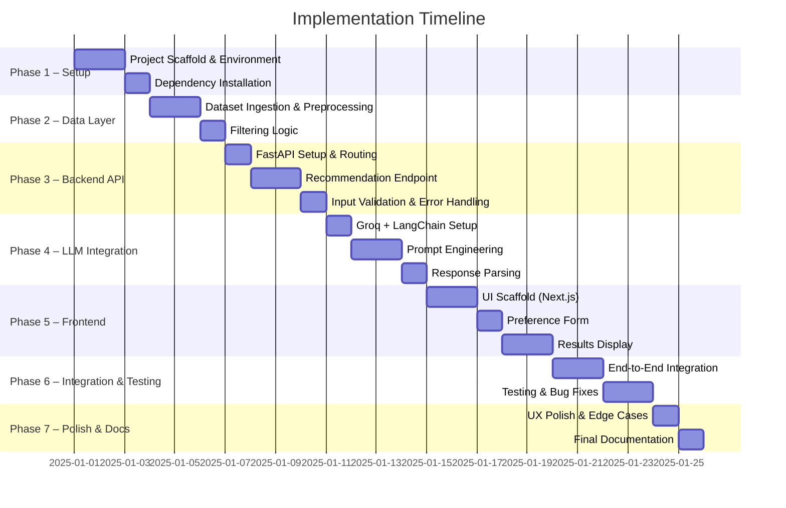

# Phase-Wise Implementation Plan
## AI-Powered Restaurant Recommendation System (Zomato Use Case)

> **Stack**: Python · FastAPI · Pandas · Hugging Face Datasets · LangChain · Groq LPU · React / Next.js
> **LLM**: Groq API — `llama3-8b-8192` or `mixtral-8x7b-32768`
> **Dataset**: [`ManikaSaini/zomato-restaurant-recommendation`](https://huggingface.co/datasets/ManikaSaini/zomato-restaurant-recommendation)

---

## Overview



---

## Phase 1 — Project Setup & Environment Configuration

**Goal**: Establish the project structure, configure virtual environments, and install all dependencies.

### 1.1 Directory Structure

```
zomato-recommendation/
├── backend/
│   ├── main.py                  # FastAPI entry point
│   ├── api/
│   │   └── routes.py            # API route definitions
│   ├── data/
│   │   ├── loader.py            # HuggingFace dataset ingestion
│   │   └── filter.py            # Restaurant filtering logic
│   ├── llm/
│   │   ├── prompt.py            # Prompt templates
│   │   ├── engine.py            # Groq/LangChain LLM calls
│   │   └── parser.py            # Response parsing
│   ├── models/
│   │   └── schemas.py           # Pydantic request/response models
│   └── requirements.txt
├── frontend/
│   ├── app/
│   │   ├── page.tsx             # Main landing/input page
│   │   └── results/page.tsx     # Recommendation display page
│   ├── components/
│   │   ├── PreferenceForm.tsx
│   │   └── RestaurantCard.tsx
│   └── package.json
├── docs/
│   ├── context.md
│   ├── architecture.md
│   └── implementation-plan.md
└── .env                         # GROQ_API_KEY, etc.
```

### 1.2 Tasks

- [x] Initialize Git repository.
- [x] Create and activate a Python virtual environment (`venv` or `conda`).
- [x] Create `backend/requirements.txt` with the following core dependencies:
  ```
  fastapi
  uvicorn
  python-dotenv
  pydantic
  datasets
  pandas
  langchain
  langchain-groq
  groq
  ```
- [x] Initialize the Next.js frontend in `/frontend`.
- [x] Create `.env` file and add `GROQ_API_KEY`.
- [x] Configure `.gitignore` to exclude `.env`, `__pycache__`, and `node_modules`.

### 1.3 Deliverables
- ✅ Runnable Python virtual environment.
- ✅ Runnable Next.js dev server.
- ✅ `.env` with `GROQ_API_KEY` configured.

---

## Phase 2 — Data Layer: Ingestion, Preprocessing & Filtering

**Goal**: Load the Zomato dataset from Hugging Face, clean it, and expose a filtering function.

### 2.1 Dataset Ingestion (`backend/data/loader.py`)

- Load the dataset using the `datasets` library:
  ```python
  from datasets import load_dataset
  ds = load_dataset("ManikaSaini/zomato-restaurant-recommendation", split="train")
  df = ds.to_pandas()
  ```
- Extract relevant fields:
  - `restaurant_name`, `location`, `cuisines`, `average_cost_for_two`, `aggregate_rating`, `votes`, `online_order`, `book_table`, `listed_in_type`
- Perform preprocessing:
  - Drop rows with null `restaurant_name`, `location`, or `aggregate_rating`.
  - Standardize text fields to lowercase/title-case for consistent comparison.
  - Normalize `average_cost_for_two` into budget tiers:
    - **Low**: ≤ ₹300
    - **Medium**: ₹301 – ₹800
    - **High**: > ₹800
  - Cache the cleaned DataFrame as a module-level singleton (loaded once on startup).

### 2.2 Filtering Logic (`backend/data/filter.py`)

Implement `filter_restaurants(df, preferences)` that applies hard filters:

| User Input | Filter Applied |
| :--- | :--- |
| `location` | `df['location'].str.contains(location, case=False)` |
| `cuisine` | `df['cuisines'].str.contains(cuisine, case=False)` |
| `min_rating` | `df['aggregate_rating'] >= min_rating` |
| `budget` | Match against the normalized budget tier column |

- Return the top 15 matches (sorted by rating descending) as a list of dicts.
- If fewer than 3 results are found, relax constraints progressively (e.g., drop cuisine filter).

### 2.3 Deliverables
- [x] `loader.py` — dataset loaded, cleaned, and cached.
- [x] `filter.py` — filtering returns a clean list of restaurant dicts.
- [x] Unit-testable with sample inputs.

---

## Phase 3 — Backend API (FastAPI)

**Goal**: Build a REST API that accepts user preferences and returns LLM-powered recommendations.

### 3.1 Request/Response Schema (`backend/models/schemas.py`)

Define Pydantic models:

```python
class UserPreferences(BaseModel):
    location: str
    cuisine: str
    budget: Literal["low", "medium", "high"]
    min_rating: float = 3.0
    additional_preferences: Optional[str] = ""

class RestaurantRecommendation(BaseModel):
    restaurant_name: str
    cuisine: str
    rating: float
    estimated_cost: str
    explanation: str

class RecommendationResponse(BaseModel):
    recommendations: list[RestaurantRecommendation]
```

### 3.2 API Routes (`backend/api/routes.py`)

- **`POST /api/recommend`**
  1. Parse and validate `UserPreferences` from the request body.
  2. Call `filter_restaurants()` from the Data Layer.
  3. If 0 results: return a `404` with a helpful message.
  4. Call the LLM Engine with filtered restaurants + user preferences.
  5. Parse and return the `RecommendationResponse`.

- **`GET /api/health`** — basic health check endpoint.

### 3.3 FastAPI App (`backend/main.py`)

- Mount the router.
- Add CORS middleware to allow frontend origin.
- On startup, trigger dataset loading and caching.

### 3.4 Deliverables
- [x] `POST /api/recommend` responds with valid JSON.
- [x] Input validation and error handling working.
- [x] CORS configured for frontend dev server (`localhost:3000`).
- [x] Swagger UI auto-docs available at `/docs`.

---

## Phase 4 — LLM Integration (Groq + LangChain)

**Goal**: Build the Prompt Engineering Module and LLM Engine to generate ranked, explained recommendations via Groq.

### 4.1 Groq + LangChain Setup (`backend/llm/engine.py`)

```python
from langchain_groq import ChatGroq
import os

llm = ChatGroq(
    model="llama3-8b-8192",
    api_key=os.environ["GROQ_API_KEY"],
    temperature=0.3,
)
```

- Use `temperature=0.3` for consistent, factual recommendations.
- Fallback model: `mixtral-8x7b-32768` for longer prompts.

### 4.2 Prompt Template (`backend/llm/prompt.py`)

```python
from langchain.prompts import PromptTemplate

RECOMMENDATION_PROMPT = PromptTemplate(
    input_variables=["location", "cuisine", "budget", "min_rating",
                     "additional_preferences", "restaurants_json"],
    template="""
You are an expert restaurant recommendation assistant.

User Preferences:
- Location: {location}
- Preferred Cuisine: {cuisine}
- Budget: {budget}
- Minimum Rating: {min_rating}
- Additional Notes: {additional_preferences}

Here are restaurants that match the basic filters:
{restaurants_json}

Select the TOP 3 restaurants from the list above. For each, return:
1. restaurant_name
2. cuisine
3. rating (as a float)
4. estimated_cost (as a string, e.g., "₹400 for two")
5. explanation (2-3 sentences on why it suits the user)

Respond ONLY with a valid JSON array of 3 objects. No extra text.
"""
)
```

### 4.3 LLM Call & Response Parsing (`backend/llm/parser.py`)

- Invoke the chain: `RECOMMENDATION_PROMPT | llm`.
- Parse the `AIMessage.content` string as JSON.
- Validate each object against `RestaurantRecommendation` schema.
- Handle malformed JSON with a try/except and return a graceful error.

### 4.4 Deliverables
- ✅ Groq API connection verified.
- ✅ LangChain chain invokable with sample data.
- ✅ JSON response parsed into `RestaurantRecommendation` objects reliably.
- ✅ Tested with at least 3 different input combinations.

---

## Phase 5 — Frontend (Next.js)

**Goal**: Build a clean, responsive UI for input collection and recommendation display.

### 5.1 Preference Form (`frontend/components/PreferenceForm.tsx`)

Collect the following inputs:
| Field | UI Component | Example |
| :--- | :--- | :--- |
| Location | Text input | "Delhi", "Bangalore" |
| Cuisine | Text input or Dropdown | "Italian", "Chinese" |
| Budget | Radio/Select | Low / Medium / High |
| Minimum Rating | Slider (1.0–5.0) | 4.0 |
| Additional Notes | Textarea | "Family friendly, outdoor seating" |

- On submit, call `POST /api/recommend` with the preference payload.
- Show a loading spinner while the API call is in progress.

### 5.2 Restaurant Card (`frontend/components/RestaurantCard.tsx`)

Display for each recommendation:
- 🏠 **Restaurant Name** (large, bold)
- 🍽️ **Cuisine**
- ⭐ **Rating** (with a star icon)
- 💰 **Estimated Cost**
- 🤖 **AI-Generated Explanation** (highlighted in a subtle accent box)

### 5.3 Pages
- **`/` (Home)**: Hero section + `PreferenceForm`.
- **`/results`** (or inline below form): Renders a list of `RestaurantCard` components.

### 5.4 Deliverables
- ✅ Form submits preferences to the backend.
- ✅ Recommendation cards render correctly with all 5 fields.
- ✅ Loading and error states handled.
- ✅ Responsive layout (mobile + desktop).

---

## Phase 6 — End-to-End Integration & Testing

**Goal**: Connect all components and validate the complete user journey.

### 6.1 Integration Checklist

- [ ] Frontend form → Backend API → Data Filter → Prompt → Groq → Parser → Response → UI.
- [ ] Verify CORS headers allow frontend origin.
- [ ] Verify `.env` variable `GROQ_API_KEY` is loaded correctly in the backend.
- [ ] Test with at least 5 different city + cuisine combinations.

### 6.2 Edge Case Testing

| Scenario | Expected Behavior |
| :--- | :--- |
| No restaurants match filters | Return user-friendly "No results found" message |
| LLM returns malformed JSON | Return 500 with descriptive error, log internally |
| Groq API rate limit hit | Return 429 with a retry message |
| User submits empty form | Frontend validation shows field-level errors |
| Dataset field is null/NaN | Preprocessing handles it — no crash |

### 6.3 Deliverables
- ✅ All 5 test journeys pass end-to-end.
- ✅ Edge cases handled gracefully.
- ✅ No unhandled exceptions in backend logs.

---

## Phase 7 — Polish, Optimization & Documentation

**Goal**: Finalize UX, optimize performance, and complete project documentation.

### 7.1 UX Polish
- Add smooth loading animations on the results page.
- Add a "Try Again" / "Search Again" button after results are shown.
- Add a sample/demo button to auto-fill the form with example preferences.

### 7.2 Performance Optimization
- Confirm the Zomato dataset is loaded **once** at startup and reused (not re-fetched per request).
- Keep the LLM prompt concise — pass only top 10–15 filtered restaurants to stay within token limits.
- Use `async` FastAPI routes for non-blocking LLM calls.

### 7.3 Documentation
- Update `README.md` with:
  - Setup instructions (backend + frontend).
  - How to add the `GROQ_API_KEY` to `.env`.
  - How to run both servers locally.
- Final review of `context.md`, `architecture.md`, and this `implementation-plan.md`.

### 7.4 Deliverables
- ✅ Polished UI with animations.
- ✅ `README.md` fully written.
- ✅ All docs in `/docs` are up to date.

---

## Summary Table

| Phase | Focus Area | Key Output |
| :---: | :--- | :--- |
| **1** | Setup & Scaffold | Project structure, virtual env, deps installed |
| **2** | Data Layer | Dataset loaded, cleaned, filtered |
| **3** | Backend API | `POST /api/recommend` functional |
| **4** | LLM Integration | Groq + LangChain pipeline working |
| **5** | Frontend | Next.js UI with form + result cards |
| **6** | Integration & Testing | End-to-end validated, edge cases handled |
| **7** | Polish & Docs | Production-ready UX + full documentation |
